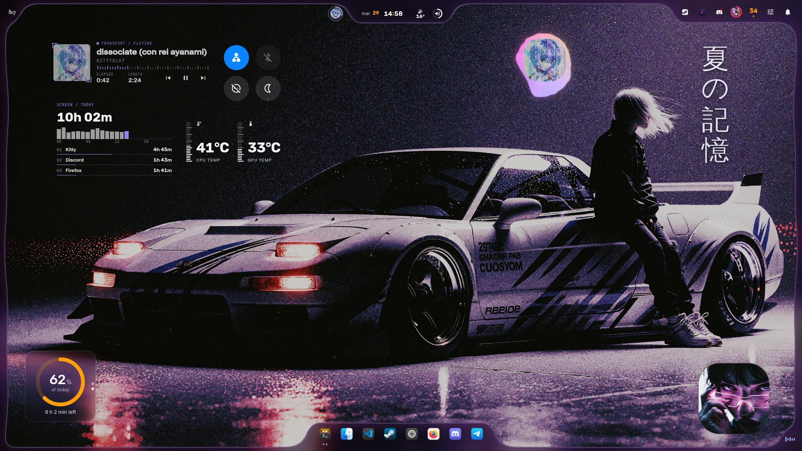

<p align="center">
  
</p>

<h1 align="center">iNiR</h1>

<p align="center">
  <b>基于 Quickshell 的 Niri 完整桌面 shell</b>
</p>

<p align="center">
  <a href="https://github.com/snowarch/inir/releases"></a>
  <a href="https://github.com/snowarch/inir/stargazers"></a>
  <a href="https://discord.gg/pAPTfAhZUJ"></a>
  <a href="../../LICENSE"></a>
</p>

<p align="center">
  <a href="https://github.com/snowarch/inir/wiki/INSTALL">安装</a> &bull;
  <a href="https://github.com/snowarch/inir/wiki/KEYBINDS">快捷键</a> &bull;
  <a href="https://github.com/snowarch/inir/wiki/IPC">IPC 参考</a> &bull;
  <a href="https://discord.gg/pAPTfAhZUJ">Discord</a> &bull;
  <a href="../../CONTRIBUTING.md">参与贡献</a>
</p>

<p align="center">
  <sub>
    <a href="../../README.md">English</a> · <a href="README.es.md">Español</a> · <a href="README.ru.md">Русский</a> · <a href="README.zh.md">中文</a> · <a href="README.ja.md">日本語</a> · <a href="README.pt.md">Português</a> · <a href="README.fr.md">Français</a> · <a href="README.de.md">Deutsch</a> · <a href="README.ko.md">한국어</a> · <a href="README.hi.md">हिन्दी</a> · <a href="README.ar.md">العربية</a> · <a href="README.it.md">Italiano</a>
  </sub>
</p>

---

> **关于翻译：** 如有不清楚的地方，请以[英文版](../../README.md)为准。

---

<details>
<summary><b>🤔 第一次来？如果完全不知道这是什么，点这里</b></summary>

### 这是什么？

iNiR 就是你的整个桌面。顶部的栏、dock、通知、设置、壁纸，全部都是。它不是主题，也不是拿来粘贴的 dotfiles，而是一个运行在 Linux 上的完整 shell。

### 运行它需要什么？

一个合成器。它负责管理窗口，把像素画到屏幕上。iNiR 为 [Niri](https://github.com/YaLTeR/niri)（一个 Wayland 平铺合成器）而做。代码里还留着一些 Hyprland 的旧代码，来自它还是 end-4 dots 分支的时候，但我真正在用、在测试的是 Niri。

这个 shell 运行在 [Quickshell](https://quickshell.outfoxxed.me/) 上，它是一个用 QML（Qt 的界面语言）构建 shell 的框架。使用时这些都不用懂：一切都能在图形界面或 JSON 文件里配置。

### 各部分如何连接

```
your apps
   ↓
iNiR (shell: bar, sidebars, dock, notifications, settings...)
   ↓
Quickshell (runs QML shells)
   ↓
Niri (compositor: windows, rendering)
   ↓
Wayland → GPU
```

### 稳定吗？

这是一个做着做着就停不下来的个人项目。我每天都在用，Discord 里也有很多人在用。但偶尔还是会坏，代码有些地方很乱，我也在边做边学。

如果有东西不工作，`inir doctor` 能修好大部分问题。还不行的话，Discord 很活跃。只是别指望它是打磨完美的软件：这是一个人的 rice，碰巧别人也喜欢。

### 为什么会有它？

我想让自己的桌面长成某个样子、按某种方式工作，而没有任何东西正好做到这一点。它从 end-4 的 Hyprland dots 起步，后来变成了为 Niri 完全重写、功能多得多的版本。

### 你会看到的词

- **Shell**：界面层（栏、面板、覆盖层）
- **合成器**：管理窗口、绘制屏幕（Niri、Hyprland、Sway...）
- **Wayland**：Linux 的显示协议（新的那个，取代 X11）
- **QML**：Qt 的声明式界面语言，iNiR 就是用它写的
- **Material You**：Google 从图片生成配色的颜色系统（自动主题就是靠它）
- **ii / waffle / iRiS**：三个面板家族。ii 是 Material Design 风格，waffle 是 Windows 11 风格，iRiS 是一个会变成你所打开内容的 Island。`Super+Shift+W` 在它们之间切换

</details>

---

## 截图

<details open>
<summary><b>iRiS</b>：Island、Customize、菜单栏、卡片和 Dock</summary>

<p align="center">
  
  
</p>

<p align="center">
  
</p>

</details>

<details open>
<summary><b>Material ii</b>：浮动栏、侧边栏、Material Design 风格</summary>

| | |
|:---:|:---:|
|  |  |
|  |  |
|  |  |

</details>

<details>
<summary><b>Waffle</b>：底部任务栏、操作中心、Windows 11 风格</summary>

| | |
|:---:|:---:|
|  |  |

</details>

---

> [!WARNING]
> 不适合低配机器。
> 不过可以大幅精简：关掉特效、去掉面板、简化设计。在设置里或 `config.json` 里都行。

## 功能

**三个面板家族**，用 `Super+Shift+W` 随时切换：
- **Material ii**：浮动栏、侧边栏、dock 和 9 种全局风格（Material、Cards、Aurora、iNiR、Angel、Regalia、ZZZ、Cookie Shapes、Editorial）
- **Waffle**：Windows 11 风格的任务栏、开始菜单、操作中心和通知中心
- **iRiS**：旗舰家族。可以放在屏幕任意边缘的 Island，能展开成页面、卡片和面板；可以随处摆放的组件；可以放在任意边缘的 Dock；玻璃质感；彻底重新设计的 Themes；浅色、墨色和深色；以及直接在 shell 上进行的 Customize

**自动主题**。选一张壁纸，一切随之变化：
- 通过 Material You 生成 shell 颜色，并同步到 GTK3/4、Qt、终端、Firefox、Discord、SDDM
- 10 个主题目标：终端、编辑器、浏览器、Spicetify、Steam、Cava 等
- 主题预设：Regalia / Regalia Ivory、Gruvbox、Catppuccin、Rosé Pine 以及自定义

**为 Niri 打造。** Hyprland 代码是分支时留下的，没有测试。

**Kira** 是吉祥物，如果你愿意，她会住在你的桌面上。默认关闭，美术包需要单独下载。

<details>
<summary><b>完整功能列表</b></summary>

### iRiS

- **Island**：屏幕边缘的一个形状，告诉你“正在发生什么”，并变成你打开的页面、卡片或面板，然后再收起来。可放在上、下、左、右（`inir iris edge <side>`，或直接拖过去）。放在侧边时它会竖起来，时钟竖排，气泡在上下两侧
- **菜单栏**：一条细长的栏，放着工作区、当前窗口和组件，Island 像刘海一样挂在它下面（`inir iris layout menubar`）
- **全宽栏模式**，有开始、中间和结尾三个区域，可以放 Island、工作区、焦点窗口、时间或任何组件（`inir iris zone start|center|end kinds+joined+with+plus`）
- **组件（pieces）**：天气、声音、麦克风、托盘、通知、工具、媒体、VPN、可视化器、动漫（Airing 和 Continue）以及你自己的应用，以气泡的形式放在 Island 上、屏幕轮廓上或桌面任意位置
- **组件会并入它碰到的东西**：把一个放到 Dock 或 Island 的边上，它就成为那个主体的一部分，而不是浮在上面
- **Dock** 可放在任意边缘（`inir iris dockEdge <side|auto>`）；auto 时位于 Island 对面，把一个移到另一个所在的边缘，它们会互换位置
- **玻璃**：在每个表面下对壁纸做磨砂处理，即使在明亮或花哨的壁纸上也能保持文字清晰。合成器模糊也有，但仍在开发中，先别急着评价
- **Themes**：20 套精选重新设计（Liquid Glass、Frost、Obsidian、Terminal、Neo Tokyo、Twilight、Lume、Sakura、Unit-01 等），以及你自己的、可分享的 JSON 文件（`inir iris theme`）
- **浅色、墨色和深色**，各有自己的色调和磨砂程度，还有你的应用也会跟着使用的配色主题（Catppuccin、Nord、Rosé Pine、Tokyo Night…）（`inir iris palette`）
- **形状**：Island 和 Dock 可选胶囊、圆形、超椭圆或方形
- **在 shell 上直接 Customize**：点一下 Island、Dock 或气泡，它的选项就从原地展开，Island 下方有 Themes、Look、Pieces 和撤销（`inir iris edit`）。如果你更喜欢，Studio 会把所有内容放在屏幕旁的一个面板里
- **由你排布的控制中心**：每个共享快捷开关、播放器和每个滑块都是格子，可以拖动、从角落调整大小，并从旁边的库里添加，提供六种起始布局；右键可展开控件（`inir iris control edit`）
- **可以排练的锁屏**：真正的锁屏以可编辑状态打开，不需要解锁；移动时钟、播放器和登录框，并选择背景播放的内容，包括视频（`inir iris lock edit`）

### 主题与外观

- **9 种全局风格**：Material（实色）、Cards、Aurora（玻璃模糊）、iNiR（TUI 风格）、Angel（新粗野主义）、Regalia（黑色机身、温暖的象牙色墨水、克制的香槟色细节）、ZZZ（海报板块）、Cookie Shapes（形状变换动画）、Editorial（纸墨排版）
- **来自壁纸的动态颜色**，通过 Material You 应用到整个系统
- **10 个终端和 TUI 工具自动主题化**：foot、kitty、alacritty、ghostty、wezterm、starship、fuzzel、btop、lazygit、yazi
- **应用主题**：GTK3/4、Qt（通过 plasma-integration 和 darkly）、Firefox（MaterialFox）、Discord/Vesktop（System24）、Zed、Spicetify、Steam、SDDM
- **主题预设**：Gruvbox、Catppuccin、Rosé Pine 等，或者自己做一个
- **视频壁纸**：mp4/webm/gif，可选模糊，也可以冻结第一帧以节省性能
- **桌面小组件**：所有小组件共用一种设计（iRiS、Material、iNstrument 或 Readout），像 iOS 那样轮换的堆叠，以及随下方壁纸变化的墨色

### 栏

- **6 种栏样式**：classic、islands、scenic、frame、Material 3 胶囊和 pill
- **Pill 栏**：一个会变形的中央岛，悬停时展开工作区、启动器、混音器、媒体、日历和录屏
- **模块化布局**，设置里有拖放编辑器，任何模块都能放到任何位置
- **垂直栏**，给想要把屏幕边缘拿回来的人

### 侧边栏与小组件（Material ii）

左侧栏（应用抽屉）：
- **AI 聊天**：Ollama、LM Studio、OpenRouter、Gemini、Groq、Mistral、Cerebras、Anthropic、OpenAI 和 OpenCode 的实时模型目录
- **YT Music**：无需 cookie 的 InnerTube 播放器，支持搜索、队列、电台和同步歌词
- **Wallhaven 浏览器**：直接搜索并应用壁纸
- **动漫追踪**：集成 AniList，带播出时间表
- **翻译**：通过 Gemini 或 translate-shell
- **可拖动小组件**：加密货币、媒体播放器、快速笔记、状态环、周历

右侧栏：
- **日历**，集成事件
- **通知中心**
- **快捷开关**：WiFi、蓝牙、夜间模式、勿扰、电源模式、WARP VPN、EasyEffects
- **音量混合器**，可按应用调节
- **蓝牙和 WiFi** 设备管理
- **番茄钟**、**待办**、**计算器**、**记事本**
- **系统监视器**：CPU、内存、温度

### 工具

- **工作区概览**：适配 Niri 的滚动模型，带应用搜索和计算器
- **仪表板**：可配置的三栏覆盖层，包含日程、通知、待办、笔记、媒体和天气
- **边缘工作区条**：悬停时出现，带实时工作区预览，可拖动排序
- **窗口切换器**：跨所有工作区的动画 Alt-Tab，Niri 自带了之后改为可选
- **剪贴板管理**：带搜索和图片预览的历史
- **区域工具**：截图、录屏、OCR、以图搜图
- **快捷键速查**：从你的 Niri 配置中读取快捷键
- **媒体控制**：完整的 MPRIS 播放器，多种布局
- **屏幕提示**：音量、亮度和媒体
- **听歌识曲**：通过 SongRec 实现类似 Shazam 的识别
- **语音输入**：已安装时使用本地 whisper.cpp，或连接 Groq、Gemini、OpenAI

### 系统

- **图形化设置**：不碰文件就能配置一切
- **GameMode**：全屏应用时自动关闭特效
- **自动更新**：`inir update`，支持回滚、迁移并保留你的改动
- **锁屏**和**会话屏幕**（注销/重启/关机/挂起）
- **Polkit 代理**、**屏幕键盘**、基于 niri 自身启动文件的**自启动管理**
- **Kira**：一个像素风猫娘，会在屏幕边缘走来走去，对你的操作做出反应，还有混乱模式。可选，单独的约 32 MiB 美术包在 `./setup` › Extras 里
- **18 种语言**，自动检测，包括印尼语（`id_ID`）和格陵兰语（`kl_GL`）
- **夜间模式**：定时或手动
- **天气**：Open-Meteo，支持 GPS、手动坐标或城市名
- **电池管理**：可配置阈值，电量危急时自动挂起
- **自定义事件音效**，有总音量，每个事件可用单独的音频文件
- **更新检查**：有新版本时提醒你

</details>

---

## 快速开始

```bash
git clone https://github.com/snowarch/inir.git
cd inir
./setup install       # interactive, asks before each step
./setup install -y    # automatic, no questions asked
```

安装程序会处理依赖、系统配置和主题。安装完成后，运行 `inir run` 启动 shell，或者注销后重新登录。

```bash
inir run                        # launch the shell
inir settings                   # open settings GUI
inir logs                       # check runtime logs
inir doctor                     # auto-diagnose and fix
inir update                     # pull + migrate + restart
```

如果 `./setup install` 不是你想要的，还有其他方式：

```bash
./setup                 # TUI menu, pick what you want
sudo make install       # system-wide instead of your home
./setup rollback        # undo the last update
```

**发行版：** Arch 是首要目标。Fedora 和 Debian/Ubuntu 也有自动安装依赖的路径，优先使用发行版仓库；其他发行版请参考[软件包列表](https://github.com/snowarch/inir/wiki/PACKAGES)中的通用说明。iNiR 需要 Qt 6.9 或更新版本：Ubuntu 25.10、Fedora 43 以及 Debian testing 或更新版本。

---

## 快捷键

| 按键 | 操作 |
|-----|--------|
| <kbd>Super</kbd> + <kbd>Space</kbd> | 概览：搜索应用、切换工作区 |
| <kbd>Super</kbd> + <kbd>V</kbd> | 剪贴板历史 |
| <kbd>Super</kbd> + <kbd>Shift</kbd> + <kbd>S</kbd> | 区域截图 |
| <kbd>Super</kbd> + <kbd>Shift</kbd> + <kbd>X</kbd> | 区域 OCR |
| <kbd>Super</kbd> + <kbd>,</kbd> | 设置 |
| <kbd>Super</kbd> + <kbd>Shift</kbd> + <kbd>W</kbd> | 切换面板家族 |
| <kbd>Super</kbd> + <kbd>/</kbd> | 快捷键速查，以防你忘了其他的 |

完整列表：[快捷键](https://github.com/snowarch/inir/wiki/KEYBINDS)

---

## 壁纸

自带 15 张壁纸。想要更多，可以看看 [iNiR-Walls](https://github.com/snowarch/iNiR-Walls)，一个和 Material You 配合很好的精选合集。

---

## 文档

面向用户的内容都在 [Wiki](https://github.com/snowarch/inir/wiki) 里（英文）。

| 页面 | 内容 |
|---|---|
| [Install](https://github.com/snowarch/inir/wiki/INSTALL) | 让它跑起来 |
| [Setup](https://github.com/snowarch/inir/wiki/SETUP) | 更新、迁移、回滚 |
| [Keybinds](https://github.com/snowarch/inir/wiki/KEYBINDS) | 所有快捷键 |
| [IPC](https://github.com/snowarch/inir/wiki/IPC) | 可用于绑定或脚本的命令 |
| [Packages](https://github.com/snowarch/inir/wiki/PACKAGES) | 每个依赖以及为什么需要它 |
| [Limitations](https://github.com/snowarch/inir/wiki/LIMITATIONS) | 已知问题和绕过方法 |
| [Architecture](../../ARCHITECTURE.md) | 代码是怎么组织的 |

---

## 故障排除

```bash
inir logs                       # check recent runtime logs
inir restart                    # restart the active runtime
inir repair                     # doctor + restart + filtered log check
./setup doctor                  # auto-diagnose and fix common problems
./setup rollback                # undo the last update
```

提 issue 之前先看看 [Limitations](https://github.com/snowarch/inir/wiki/LIMITATIONS)。如果你更想直接问人，Discord 会更快。

---

## 参与贡献

开发环境、代码规范和提交 pull request 的方式见 [CONTRIBUTING.md](../../CONTRIBUTING.md)。

---

## 致谢

- [**end-4**](https://github.com/end-4/dots-hyprland)：illogical-impulse，iNiR 分支自的 Hyprland dots
- [**pctrade/end4-pC**](https://github.com/pctrade/end4-pC)：一个时不时有真正好点子的分支
- [**Gakuseei**](https://github.com/Gakuseei)：[Ricelin](https://github.com/Gakuseei/Ricelin)，pill 栏以及 washi 和 flame 风格的来源
- [**Quickshell**](https://quickshell.outfoxxed.me/)：它运行所依赖的框架
- [**Niri**](https://github.com/YaLTeR/niri)：它为之打造的合成器

GPL-3.0，与 end-4 的 dots 相同。Copyright (C) 2025-2026 snowarch.

---

<p align="center">
  
</p>

---

<p align="center">
  <a href="https://github.com/snowarch/inir/graphs/contributors">贡献者</a> &bull;
  <a href="../../CHANGELOG.md">更新日志</a> &bull;
  <a href="../../LICENSE">GPL-3.0 许可证</a>
</p>
